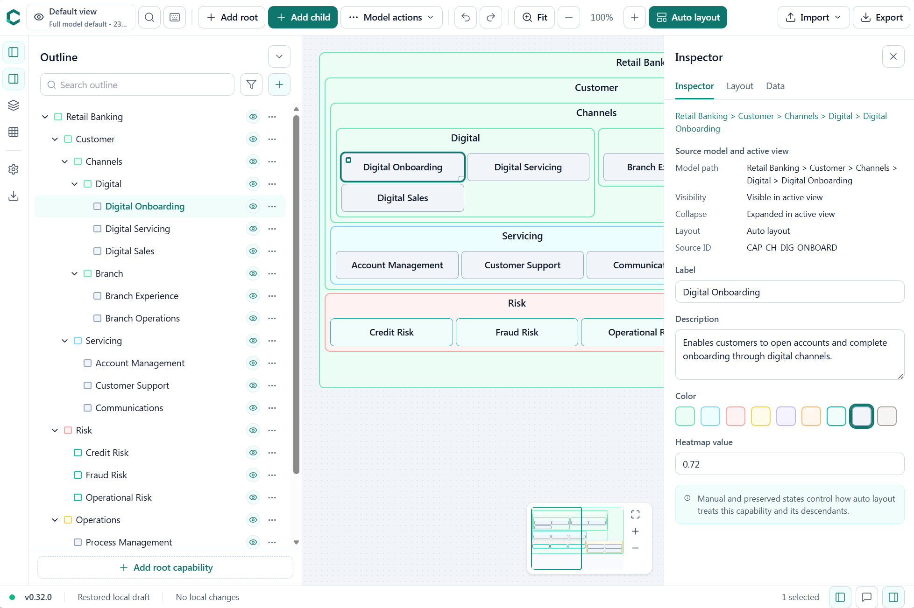

# Capability Canvas

Local-first hierarchical capability modeling for people who need structured
business diagrams without handing sensitive context to a server.



Capability Canvas is a browser-based editor for capability maps, domain maps,
operating models, product landscapes, and similar containment-first diagrams. It
keeps the hierarchy as real structured data, arranges nested capabilities with
deterministic layout modes, and still allows deliberate manual control when a
diagram needs presentation polish.

## Version 1.0.0 Scope

The 1.0 release focuses on a complete local modeling workflow:

- Build and edit nested capability hierarchies directly on the canvas or through
  the outline.
- Save work automatically in the browser and exchange full-fidelity documents as
  JSON files.
- Maintain multiple saved visual views over the same source model, including
  level maps, domain deep-dives, heatmap views, executive views, and slide-ready
  views.
- Use automatic layout where structure matters and manual positioning, locks,
  alignment, distribution, and same-size tools where presentation matters.
- Validate, review, repair, import, and export diagrams without a backend.
- Use read-only viewer mode and export visuals for documents, presentations,
  diagrams.net, and architecture tooling.

## Highlights

- **Local-first by default**: diagrams and autosave snapshots are stored in
  IndexedDB; UI preferences such as panel state and export format are stored in
  LocalStorage.
- **Hierarchy-aware modeling**: roots, parents, leaves, and text labels are
  modeled as document nodes rather than generic shapes.
- **Saved visual views**: views can hide, collapse, relayout, and export subsets
  of the source model without deleting source capabilities.
- **Layout modes**: adaptive, balanced, flow, uniform, and freeform layout modes
  preserve locked nodes, manual positioning, containment, and view-specific
  layout choices.
- **Power editing**: drag, resize, reparent, inline rename, duplicate, remove
  from active view, delete from source model, align, distribute, bulk color,
  same-size, keyboard nudge, undo, and redo.
- **Outline navigation**: search labels, ids, descriptions, and metadata; jump
  to results; restore hidden outline results to the active view.
- **Inspector and settings**: edit properties, descriptions, layout flags,
  heatmap values, document defaults, grid behavior, dimensions, typography, page
  framing, and export defaults.
- **Heatmap workflow**: store per-node scores, import scores from CSV, choose
  palettes, toggle legends, and render the same fills in the editor, viewer, and
  visual exports.
- **Import review**: JSON imports are parsed, repaired where safe, summarized,
  and confirmed before replacing the current document.
- **BCM prompt merge**: copy a structured business capability prompt from a
  selected node and paste the returned merge JSON back into the model.
- **Command access**: command palette, shortcut help, context menus, keyboard
  shortcuts, and accessible menu/focus behavior are available across the editor
  and viewer.
- **Portable exports**: JSON, SVG, standalone HTML, PowerPoint, diagrams.net
  `.drawio`, and ArchiMate Open Exchange XML.
- **Static PWA deployment**: the app builds as a static Vite PWA and deploys to
  GitHub Pages from `master`.

## Use The App

Production builds are published through GitHub Pages:

[https://thomasrohde.github.io/capability-canvas/](https://thomasrohde.github.io/capability-canvas/)

To run locally:

```bash
npm install
npm run dev
```

Open the local Vite URL printed by the dev server, usually
`http://localhost:5173`.

## Common Commands

```bash
npm run dev          # Start the Vite dev server
npm run build        # Type-check and build for production
npm run typecheck    # Type-check without emit
npm run lint         # ESLint with zero warnings
npm run test:run     # Vitest, single pass
npm run test:e2e     # Playwright smoke tests
```

## Core Workflows

### Model

Create root capabilities, add children, rename labels inline, edit descriptions
and data in the inspector, and keep the source model valid through command-based
transactions. Source-model deletion is separate from removing a node from the
active visual view, so presentation views can be curated without losing data.

### Arrange

Use automatic layout for the current view or selected areas, then refine the
result manually. Locked nodes preserve their geometry during layout changes,
manual-positioning parents preserve their child placement, and containment repair
keeps parents large enough for visible children.

### View

Create saved views from built-in templates:

- Full model default
- Level 1, Level 2, Level 3, and Level 4 maps
- Executive overview
- Domain deep-dive
- Heatmap overview
- Presentation slide

Each view can carry its own visibility, collapse state, layout, viewport,
heatmap display, and export settings while sharing the same source hierarchy.

### Import

Import a Capability Canvas JSON document from a file or pasted JSON. The import
review summarizes title, node count, view count, repairs, diagnostics, and
whether the input can be applied. Schema-less hierarchy JSON and prompt-merge
payloads are supported where they can be converted safely.

### Export

The export drawer validates the active document before writing files and reports
format-specific behavior for hidden nodes, heatmap data, and legends.

| Format | Scope | Notes |
| --- | --- | --- |
| JSON | Full source model | Full-fidelity backup, sharing, and round-trip import |
| SVG | Active visual view | Embeddable vector visual with active-view styling |
| HTML | Active visual view | Standalone browser-readable visual export |
| PowerPoint | Active visual view | Native editable shapes via `pptxgenjs` |
| diagrams.net | Active visual view | `.drawio` XML with nested geometry |
| ArchiMate | Source model | Open Exchange XML for architecture tools |

## Data And Privacy

Capability Canvas does not require a backend for core use. The editor runs in the
browser, autosaves the committed document locally, and stores only small UI
preferences in LocalStorage. Explicit JSON export is the supported
full-fidelity sharing format.

The static GitHub Pages build can be installed as a PWA where the browser
supports it. Browser storage behavior still applies: clearing site data removes
local autosave and preferences, so export important work as JSON when you need a
durable file backup.

## Architecture

The codebase keeps product rules in a pure TypeScript domain layer and lets
React features orchestrate those rules through stores.

| Layer | Responsibility |
| --- | --- |
| `src/domain/` | Document model, commands, validation, layout, selection, visual view rules |
| `src/app/` | Zustand stores, persistence, import hydration, routing, autosave coordination |
| `src/features/` | React feature shells for canvas, outline, inspector, settings, export, views, commands, viewer |
| `src/test/` | Shared fixtures and test harnesses |

The internal document model is normalized with `nodesById` for direct lookup and
`childrenByParentId` for ordered hierarchy traversal. The root list is stored
under `childrenByParentId["__root__"]`; there is no synthetic root node.

All model changes go through command transactions. That keeps undo/redo,
autosave, validation, import repair, active-view state, and containment repair
predictable.

## Testing And Quality

The release test suite covers:

- domain invariants, JSON parse/serialize, migrations, and repair diagnostics;
- command transactions, undo/redo, prompt merge, selection, and bulk operations;
- layout determinism, containment, balanced aspect-ratio framing, locked nodes,
  manual positioning, and large-fixture layout quality;
- heatmap CSV import and fill consistency across editor, minimap, viewer, and
  exports;
- import review, export validation, settings, inspector, outline, visual views,
  command palette, shortcut help, and viewer behavior;
- Playwright smoke coverage for editor shell, keyboard workflows, import review,
  inline editing, saved views, bulk selection, outline search, transient
  selection previews, and read-only viewer mode.

Before a 1.0.0 release, run:

```bash
npm run lint
npm run typecheck
npm run test:run
npm run build
npm run test:e2e
```

## Documentation

The product and engineering contracts live in [`docs/README.md`](docs/README.md):

- [Product brief](docs/product-brief.md)
- [Domain model](docs/domain-model.md)
- [Interaction contracts](docs/interaction-contracts.md)
- [Tech stack](docs/tech-stack.md)
- [Agent implementation brief](docs/agent-implementation-brief.md)
- [Adapter notes for ArchiMate](docs/adapters/archimate.md)
- [Adapter notes for diagrams.net](docs/adapters/drawio.md)

## Release Notes

This repository is maintained as a single-developer project on `master`.

For a version bump, run the appropriate version script, commit the intended
changes and version bump, then push `master` to trigger the GitHub Pages
deployment:

```bash
npm run version:major
git add package.json package-lock.json README.md
git commit -m "Release v1.0.0"
git push origin master
```

After pushing, confirm the GitHub Pages workflow completes and the public site
serves the expected version.

## License

Capability Canvas is available under the [MIT License](LICENSE).
